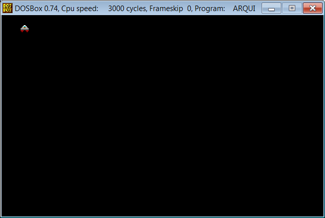

## Cómo hacer un juego en ensamblador

Este es un ejemplo básico de una plantilla de juego en ensamblador, utilizando el modo 13h de la interrupción 10h con una resolución de 320 * 200.

Características:

- Doble buffer para dibujar en memoria
- Función de retardo (delay) utilizando la función 86h de la interrupción 15h
- Sincronización vertical (vsync) para evitar parpadeos
- Control de eventos del teclado, con una forma básica de una tecla a la vez
- Ciclo de render activo con un valor constante de FPS

Teclas de control:

- A, W, D y X para mover el personaje
- C para cambiar el color de fondo
- B para salir del programa

